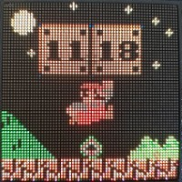

# Clockwise ESPHome - Retro Game Clocks for Home Assistant

[](https://esphome.io)
[](https://www.home-assistant.io)
[](LICENSE)

> Transform your HUB75 LED matrix into a retro game-inspired clock with Home Assistant integration! 🕐✨

This ESPHome component brings the fantastic [Clockwise](https://clockwise.page/) project to Home Assistant, featuring retro gaming clockfaces like Mario and Pac-Man with full remote control capabilities.





## ✨ Features

- **🎮 Retro Game Clockfaces**: Mario and Pac-Man themed clock displays
- **🏠 Home Assistant Integration**: Full control via Home Assistant dashboard
- **💡 Brightness Control**: Adjust display brightness (0-255) remotely
- **🌅 Automatic Brightness**: Optional LDR sensor for automatic brightness adjustment
- **🔄 Clockface Switching**: Change between clock styles on the fly
- **⚡ Power Control**: Turn display on/off remotely
- **🎯 Huidu HD-WF2 Support**: Optimized for HD-WF2 boards with automatic pin mapping
- **📱 Real-time Sync**: Time synchronized with Home Assistant

## 🎯 Home Assistant Controls

Once installed, you'll get these entities in Home Assistant:

- **Switch**: `display_power` - Turn display on/off
- **Switch**: `auto_brightness` - Enable/disable automatic brightness (when LDR is configured)
- **Number**: `display_brightness` - Adjust brightness (0-255)
- **Select**: `clockface` - Choose between Mario, Pac-Man, and other styles
- **Sensor**: `ambient_light` - Current light level percentage (when LDR is configured)

## 🏗️ Project Background

This project integrates the amazing [Clockwise](https://clockwise.page/) retro clock project by [jnthas](https://github.com/jnthas/clockwise) with Home Assistant using ESPHome. It leverages the excellent [HUB75 ESPHome component](https://github.com/stuartparmenter/hub75-esphome) by Stuart Parmenter to drive HUB75 LED matrices.

### Key Integration Points

- **Original Clockwise**: [clockwise.page](https://clockwise.page/) | [GitHub](https://github.com/jnthas/clockwise)
- **HUB75 Driver**: [hub75-esp32](https://github.com/stuartparmenter/hub75-esp32)
- **Hardware**: Optimized for Huidu HD-WF2 boards
- **Platform**: ESPHome with Home Assistant integration

## 🚀 Quick Start

### Prerequisites

**Hardware:**

- ESP32 development board (ESP32, ESP32-S3, or ESP32-S2)
- HUB75 RGB LED Matrix panel (64×32 or 64×64)
- Huidu HD-WF2 board (recommended) or compatible HUB75 driver board
- 5V power supply (adequate for your panel size)

**Software:**

- ESPHome installed (via Home Assistant or standalone)
- Home Assistant instance

### Installation

1. **Clone this repository** or add as external component:

```yaml
external_components:
  - source: github://aschoelzhorn/clockwise-esphome@main
    components: [clockwise_hub75]
```

2. **Use the example configuration**:

Start with `examples/clockwise.yaml` and modify according to your hardware setup.

3. **Configure your secrets**:

Create a `secrets.yaml` file:

```yaml
wifi_ssid: "YourWiFiSSID"
wifi_password: "YourWiFiPassword"
api_encryption_key: "your-encryption-key"
ota_password: "your-ota-password"
wifi_ap_password: "fallback-hotspot-password"
```

4. **Flash to your ESP32**:

```bash
esphome run examples/clockwise.yaml
```

## 🔧 Configuration

### Basic Configuration

```yaml
# HUB75 Display (using board preset for HD-WF2)
display:
  - platform: hub75
    id: matrix_display
    board: huidu-hd-wf2          # Automatic pin mapping
    panel_width: 64
    panel_height: 64
    shift_driver: FM6126A
    brightness: 128
    update_interval: 4294967295ms  # Never - clockwise handles updates

# Clockwise Component
clockwise_hub75:
  id: clockwise_main
  hub75_id: matrix_display
  time_id: homeassistant_time
  clockface_type: MARIO          # Options: MARIO, PACMAN
  initial_brightness: 128

# Home Assistant Controls
number:
  - platform: clockwise_hub75
    clockwise_hub75_id: clockwise_main
    id: display_brightness
    name: "Display Brightness"

switch:
  - platform: clockwise_hub75
    clockwise_hub75_id: clockwise_main
    id: display_power
    name: "Display Power"

select:
  - platform: clockwise_hub75
    clockwise_hub75_id: clockwise_main
    id: clockface_selector
    name: "Clockface"
```

### Supported Hardware

**Tested Configurations:**

- **Huidu HD-WF2** + 64×64 FM6126A panel (recommended)
- ESP32-S3 DevKit + 64×64 panel

**Board Presets Available:**

- `huidu-hd-wf2` - Automatic pin mapping for HD-WF2 boards
- Manual pin configuration available for other boards

## 🎨 Available Clockfaces

### Mario Theme

- Classic Super Mario Bros. styling
- Animated blocks and character elements
- Custom Super Mario font
- Based on: [Original Mario Clockface (cw-cf-0x01)](https://github.com/jnthas/cw-cf-0x01)

### Pac-Man Theme

- Retro Pac-Man game aesthetics
- Yellow color scheme
- Classic arcade font styling
- Based on: [Original Pac-Man Clockface (cw-cf-0x05)](https://github.com/jnthas/cw-cf-0x05)

### Automatic Brightness Control (Optional)

The display can automatically adjust brightness based on ambient light using an LDR sensor:

```yaml
substitutions:
  enable_ldr: "true"  # Initial state on first boot
  ldr_pin: GPIO4
  ldr_update_interval: "2s"

sensor:
  - platform: adc
    pin: ${ldr_pin}
    name: "Ambient Light"
    id: ambient_light
    update_interval: ${ldr_update_interval}
    attenuation: 12db
    filters:
      - sliding_window_moving_average:
          window_size: 5
      - calibrate_linear:
          - 1.3 -> 0.0    # Dark voltage -> 0%
          - 3.0 -> 100.0  # Bright voltage -> 100%
    on_value:
      # Maps 0-100% light to 20-255 brightness
```

**Home Assistant Control**: Toggle auto-brightness on/off anytime using the `switch.auto_brightness` entity - no recompilation needed! The switch state persists across reboots and can be integrated into automations.

**Calibration**: Measure your LDR voltage range in dark/bright conditions and adjust the `calibrate_linear` values accordingly. See the full example in `examples/clockwise.yaml`.

### Planned Features

- **🎮 More Themes**: Additional retro game clockfaces
- **📊 Weather Display**: Weather information integration

## 🔌 Wiring Guide

For **Huidu HD-WF2** boards, no manual wiring needed - just use `board: huidu-hd-wf2` in your configuration.

For custom setups, see the [original HUB75 ESPHome component](https://github.com/stuartparmenter/hub75-esphome).

## 🏠 Home Assistant Dashboard

Add this card to your dashboard:

```yaml
type: entities
entities:
  - entity: select.clockwise_hdwf2_clockface
    name: Clockface
  - entity: number.clockwise_hdwf2_display_brightness
    name: Display Brightness
  - entity: switch.clockwise_hdwf2_display_power
    name: Display Power
  - entity: update.clockwise_clock_firmware
    name: Firmware
title: Clockwise HD-WF2 Clock
```

## 🔧 Technical Details

### Implementation Notes

This ESPHome component adapts the original Clockwise codebase with these key changes:

- **File Structure**: Flattened directory structure (ESPHome limitation)
- **Include Paths**: Modified to use local includes (`"file.h"` vs `<file.h>`)
- **DateTime Integration**: Custom `CWDateTime.cpp` implementation for ESPHome time sync
- **Component Architecture**: Wrapper around original Clockwise rendering code

### Performance Considerations

- **ESP32-S3**: Recommended for higher refresh rates (120+ Hz)
- **ESP32**: Works well at 60-80 Hz refresh rates
- **Memory Usage**: Optimized with `-Os` compile flag
- **Power Efficiency**: Configurable brightness for power management

## 📚 Troubleshooting

### Common Issues

**Display is blank:**

- Check power supply (5V, adequate current)
- Verify wiring connections
- Verify shift driver setting (`FM6126A` vs `GENERIC`)

**Wrong colors:**

- Check RGB pin connections (some panels have colors swapped)

**Boot loops:**

- Disconnect HUB75 during ESP32 boot
- Use board presets to avoid strapping pin conflicts
- Check power supply stability

### Getting Help

- **Issues**: [GitHub Issues](https://github.com/aschoelzhorn/clockwise-esphome/issues)
- **ESPHome**: [ESPHome Discord](https://discord.gg/KhAMKrd)
- **Home Assistant**: [Community Forum](https://community.home-assistant.io)

## 📄 License

This project is licensed under the MIT License - see the [LICENSE](LICENSE) file for details.

### Acknowledgments

- **[Clockwise](https://github.com/jnthas/clockwise)** by jnthas - Original retro clock implementation
- **[HUB75-ESP32](https://github.com/stuartparmenter/hub75-esp32)** by Stuart Parmenter - HUB75 driver library
- **[ESPHome](https://esphome.io)** - Home automation platform
- **[Home Assistant](https://www.home-assistant.io)** - Home automation hub

## 🤝 Contributing

Contributions are welcome! Please feel free to submit a Pull Request.

1. Fork the repository
2. Create a feature branch (`git checkout -b feature/AmazingFeature`)
3. Commit your changes (`git commit -m 'Add some AmazingFeature'`)
4. Push to the branch (`git push origin feature/AmazingFeature`)
5. Open a Pull Request

## 🚧 Development Status

This project is maintained and tested with the hardware configurations listed above. New features and clockfaces are continuously being developed.

**Current Status**: Stable for Mario and Pac-Man clockfaces with optional auto-brightness support
