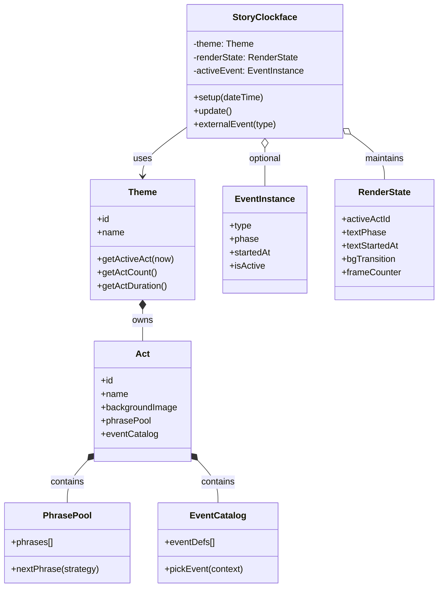

# Story Clockface Architecture

## Goal

Define a clean domain model for a generic story-driven clockface:
- one generic clock engine
- pluggable themes (Dune now, Star Trek later)
- theme content organized in acts
- phrases and events as part of act content

This is a conceptual architecture, not a mirror of current implementation.

---

## Domain Model

### Core concepts

- StoryClockface:
  Generic clock engine with a small public API (`setup`, `update`, `externalEvent`).
- Theme:
  Provides story content and story rules.
- Act:
  A story segment active for a time window.
- PhrasePool:
  Candidate phrases for the active act.
- EventCatalog:
  Possible events for the active act.
- EventInstance:
  Runtime state of an event currently playing.
- RenderState:
  Runtime visual state (active act id, text fade phase, transitions, frame counter).

### Relationships (ASCII)

```text
+-------------------+
|  StoryClockface   |
|-------------------|
| setup(dt)         |
| update()          |
| externalEvent(t)  |
+---------+---------+
          |
          | uses
          v
+-------------------+
|       Theme       |
|-------------------|
| id, name          |
| actSchedule       |
| getActiveAct(t)   |
+---------+---------+
          |
          | owns 1..N
          v
+-------------------+
|        Act        |
|-------------------|
| id, name          |
| backgroundImage   |
| phrasePool        |
| eventCatalog      |
+----+---------+----+
     |         |
     | has     | has
     v         v
+-----------+  +----------------+
|PhrasePool |  |  EventCatalog  |
|-----------|  |----------------|
|phrases[]  |  |eventDefs[]     |
+-----------+  +----------------+

Runtime-only state inside StoryClockface:
  RenderState + (optional) EventInstance
```

### Mermaid class diagram



---

## Behavioral Model

## 1. Act timing model

- Day is divided into equal act slots per theme by default.
- Example:
  - 6 acts -> 4h per act
  - 4 acts -> 6h per act
- Later extension:
  - allow weighted/variable act durations per theme.

## 2. Phrase model

- Active act owns phrase pool.
- Clockface cycles phrase lifecycle:
  - `IDLE -> FADE_IN -> HOLD -> FADE_OUT -> QUIET -> IDLE`
- Selection strategy should avoid immediate repetition.

## 3. Event model

- Events are act-scoped definitions.
- Runtime event instance is optional and short-lived.
- Event lifecycle example:
  - `INACTIVE -> START -> ACTIVE -> END -> INACTIVE`
- `externalEvent(type)` can force-start or influence event selection.

---

## Update Flow (Simple)

### ASCII flowchart

```text
update()
  |
  v
Read current time
  |
  v
Resolve active Act from Theme
  |
  +--> Act changed?
  |      |
  |      +-- yes: start background transition, reset act-scoped state
  |      +-- no: continue
  |
  v
Advance phrase state machine
  |
  v
Advance event state (or keep inactive)
  |
  v
Render layers in order:
  1) clear
  2) background (with transition if active)
  3) ambient
  4) event overlay
  5) time
  6) phrase text
  |
  v
Flush frame to display
```

### Mermaid flowchart

```mermaid
flowchart TD
    A[update()] --> B[Read current time]
    B --> C[Resolve active act from theme]
    C --> D{Act changed?}
    D -->|Yes| E[Start bg transition and reset act-scoped state]
    D -->|No| F[Keep current render state]
    E --> G[Advance phrase state machine]
    F --> G
    G --> H[Advance event state]
    H --> I[Render clear]
    I --> J[Render background]
    J --> K[Render ambient]
    K --> L[Render event overlay]
    L --> M[Render time]
    M --> N[Render phrase text]
    N --> O[Flush framebuffer/display]
```

---

## Theme Plug-in Contract

A theme should provide:
- theme identity (`id`, `name`)
- act count and timing rule
- acts with:
  - background image
  - phrase pool
  - event catalog
- optional rendering style decisions per layer (colors, typography, animations)

This allows:
- same generic clock engine
- different narrative worlds (Dune, Star Trek, ...)

---

## Suggested next modeling step

Define explicit data types for future growth:
- `ActSchedule` (equal or weighted)
- `PhraseSelectionPolicy` (random non-repeat, weighted random)
- `EventPolicy` (probability, cooldown, priority, conflict rules)

These keep story behavior configurable per theme without changing clockface core logic.
