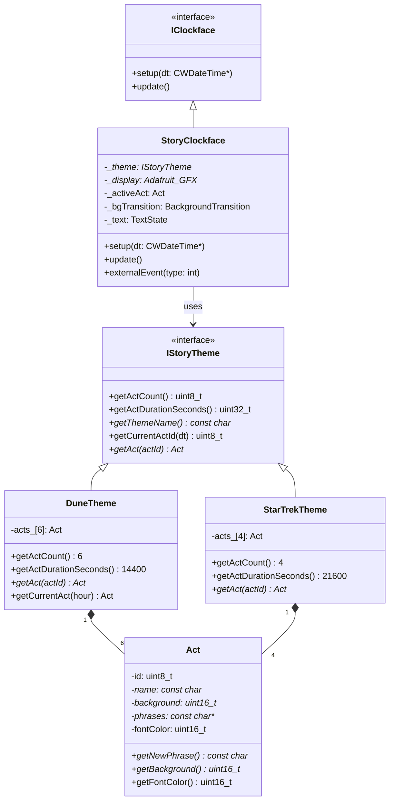
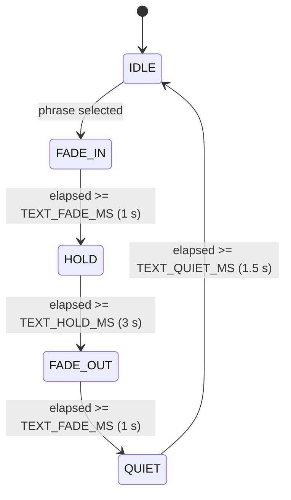

# Story Clockface — Domain Model & Architecture

## Overview

`StoryClockface` is a **generic** clockface renderer driven by a pluggable **Theme**.  
The theme supplies all narrative content (acts, phrases, backgrounds, events).  
The clockface knows nothing about Dune or Star Trek — it only knows how to run the render pipeline.

---

## Domain Model

```
IClockface
└── StoryClockface          generic orchestrator
      │  - _theme            points to active theme
      │  - _activeAct        current Act value-object (resolved each frame)
      │  - _bgTransition     state for background crossfade
      │  - _text             text phase state machine
      │
      └── IStoryTheme        interface for all themes
            │  + getActCount()
            │  + getActDurationSeconds()
            │  + getThemeName()
            │  + getCurrentActId(dt)
            │  + getAct(actId) → Act*
            │
            ├── DuneTheme    Dune implementation
            │     - acts_[6]       array of Act objects
            │     - act content:   background, phrases, fontColor
            │
            └── (StarTrekTheme)   planned
                  - acts_[4]       (example)

Act                          value object — owned by theme
  - id          uint8_t
  - name        const char*
  - background  const uint16_t*   64×64 RGB565 PROGMEM image
  - phrases     const char**      pool of narrative phrases
  - fontColor   uint16_t          RGB565
  + getNewPhrase()                returns a random phrase (avoids repeat)
  + getBackground()
  + getFontColor()
```

### Act scheduling

Each day is divided equally among the acts of the active theme:

```
actDurationSeconds = 24h / actCount
actId = currentHour / (24 / actCount)

Dune example (6 acts, 4 h each):
  00:00–03:59  Act 0  The Desert Sleeps
  04:00–07:59  Act 1  Spice Awakens
  08:00–11:59  Act 2  The Watchers
  12:00–15:59  Act 3  The Maker Stirs
  16:00–19:59  Act 4  Storm of Fate
  20:00–23:59  Act 5  Silence & Survival
```

---

## Render Pipeline (per frame)

Every call to `update()` runs the following fixed layer stack:

```
update()
  ├─ setActiveAct()          resolve Act from theme for current time
  └─ render()
       ├─ L0  layer_clear()        fill framebuffer black
       ├─ L1  layer_background()   blit/crossfade background image
       ├─ L2  layer_ambient()      animated overlay (shimmer, dust …)  [stub]
       ├─ L3  layer_event()        storm / worm / flight object         [stub]
       ├─ L4  layer_time()         HH:MM display
       ├─ L5  layer_text()         phrase fade-in / hold / fade-out
       └─     flushFramebuffer()   blit 64×64 RGB565 → display
```

---

## Class Diagram



---

## Text Phase State Machine

Phrases cycle through a simple state machine, independent of the render frame rate:



```
Total phrase cycle ≈ 7.5 s
  fade-in  1.0 s
  hold     3.0 s
  fade-out 1.0 s
  quiet    1.5 s  (no text visible, before next phrase)
```

---

## Background Transition (act change)

When the active act changes, the old and new background images are crossfaded:

```
_bgTransition.active = true
_bgTransition.from   = old background
_bgTransition.to     = new background
_bgTransition.start  = millis()
_bgTransition.duration = 2500 ms

per frame:
  alpha = elapsed / duration   (0 → 255)
  pixel = blend565(from[i], to[i], alpha)
```

---

## Per-act Content (Dune)

| Id | Name                | Phrases pool     | Font colour     |
|----|---------------------|------------------|-----------------|
| 0  | The Desert Sleeps   | PHRASES_TIME     | DIM_SAND        |
| 1  | Spice Awakens       | PHRASES_DESERT   | SPICE_AMBER     |
| 2  | The Watchers        | PHRASES_POWER    | HIGH_CONTRAST_WHITE |
| 3  | The Maker Stirs     | PHRASES_DANGER   | BRIGHT_SAND     |
| 4  | Storm of Fate       | PHRASES_DANGER   | RED_DANGER      |
| 5  | Silence & Survival  | PHRASES_SURVIVAL | COOL_BROWN      |

---

## File Map

```
story_Clockface.h / .cpp      — generic orchestrator
story_IStoryTheme.h / .cpp    — theme interface + default getCurrentActId()
story_act.h / .cpp            — Act value object
story_font.h / .cpp           — embedded 5×7 pixel font + fontIndex()

story_dune_theme.h / .cpp     — Dune theme
story_dune_phrases.h / .cpp   — Dune phrase pools (PROGMEM)
story_dune_assets.h           — Dune background images (PROGMEM RGB565)
```

---

## Extension Points

| What to add           | Where                                   |
|-----------------------|-----------------------------------------|
| New theme             | Implement `IStoryTheme`, own `Act` array |
| More acts per theme   | Change `acts_[]` size + `getActCount()` |
| Variable act durations| Override `getCurrentActId()` in theme   |
| Events (storm, worm…) | Add `Event` list to `Act`; implement `layer_event()` in clockface |
| Ambient effects       | Implement `layer_ambient()` per theme   |
