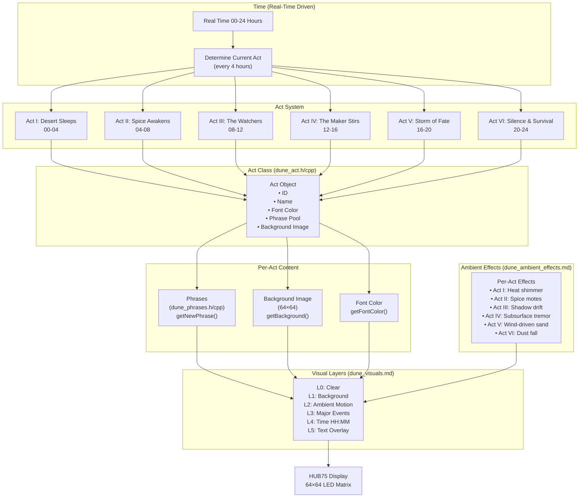

# Dune Clockface — Architecture Overview

## Overview

The Dune clockface is a 24-hour narrative experience displayed on a 64×64 LED matrix. The clock divides the day into **6 Acts**, each lasting 4 real hours, with a unique visual theme, color palette, phrase set, and ambient effects.

```
Real Time Range    Act     Narrative Theme
───────────────────────────────────────────
00:00 – 03:59      I       The Desert Sleeps
04:00 – 07:59      II      Spice Awakens
08:00 – 11:59      III     The Watchers
12:00 – 15:59      IV      The Maker Stirs
16:00 – 19:59      V       Storm of Fate
20:00 – 23:59      VI      Silence & Survival
```

---

## System Diagram

```
┌─────────────────────────────────────────────────────────────────────┐
│                     Real Time 00-24 Hours                           │
│                                                                     │
│  Determine Current Act (every 4 hours)                             │
│  ┌────────────────────────────────────────────────────────────┐   │
│  │ Act I (00-04) → Act II (04-08) → Act III (08-12) → ...    │   │
│  └────────────────────────────────────────────────────────────┘   │
└─────────────────────────────────────────────────────────────────────┘
                              ↓
┌─────────────────────────────────────────────────────────────────────┐
│                      Load Act Object                                │
│  ┌──────────────────────────────────────────────────────────────┐  │
│  │ • ID (0-5)                                                   │  │
│  │ • Name ("Desert Sleeps", "Spice Awakens", etc.)             │  │
│  │ • Phrase Pool (dune_phrases.h/cpp)                           │  │
│  │ • Font Color (RGB565)                                        │  │
│  │ • Background Image (64×64, dune_assets.h)                   │  │
│  │ • Ambient Effect Type (shimmer, shadow, sand, etc.)         │  │
│  └──────────────────────────────────────────────────────────────┘  │
└─────────────────────────────────────────────────────────────────────┘
                              ↓
┌─────────────────────────────────────────────────────────────────────┐
│                    Visual Rendering Pipeline                        │
│  ┌──────────────────────────────────────────────────────────────┐  │
│  │ Layer 0: Clear / Base                                        │  │
│  │ Layer 1: Background Image (static)                           │  │
│  │ Layer 2: Ambient Motion (heat, spice, shadow, etc.)         │  │
│  │ Layer 3: Major Event Overlays (storm, worm, flight)         │  │
│  │ Layer 4: Time Display (HH:MM) ← ALWAYS READABLE             │  │
│  │ Layer 5: Text Overlay (current phrase)                       │  │
│  └──────────────────────────────────────────────────────────────┘  │
└─────────────────────────────────────────────────────────────────────┘
                              ↓
┌─────────────────────────────────────────────────────────────────────┐
│                  HUB75 Display (64×64 LED Matrix)                   │
└─────────────────────────────────────────────────────────────────────┘
```
### Mermaid Diagram


---

## Architecture Layers

### 1. **Time System** (Real-Time Driver)

- Current system time (hours 0-23)
- Determines which Act is active
- Triggers Act transitions every 4 hours
- Drives minute/second micro-animations

### 2. **Act System** (dune_act.h/cpp)

Core class that encapsulates all per-Act data:

```cpp
class Act {
  uint8_t _id;              // 0-5
  const char* _name;        // "Desert Sleeps", etc.
  const char** _phrases;    // Phrase pool for this Act
  size_t _phraseCount;      // Number of phrases
  const uint16_t* _background;  // 64×64 background image
  uint16_t _fontColor;      // Text/time rendering color
  int _lastPhraseIndex;     // Avoid phrase repetition
};
```

**Key Methods:**
- `getId()` – Act number (0-5)
- `getName()` – Human-readable name
- `getNewPhrase()` – Random phrase from pool, never repeats consecutively
- `getBackground()` – 64×64 image pointer
- `getFontColor()` – RGB565 color for text overlay

---

### 3. **Content Pools**

#### A. **Phrases** (dune_phrases.h/cpp)

Per-Act phrase sets designed to reinforce the narrative:

| Act | Example Phrases |
|-----|-----------------|
| I   | "The sand remembers", "Time flows in dunes" |
| II  | "Spice rises", "Gold beneath the dunes" |
| III | "Watched by all", "Eyes from above" |
| IV  | "Deep power stirring", "The ancient ones wake" |
| V   | "Chaos unleashed", "Storm without mercy" |
| VI  | "All returns to silence", "Endurance remains" |

#### B. **Backgrounds** (dune_assets.h)

One static 64×64 image per Act:
- Pre-rendered or palette-optimized
- Low contrast design (text must remain readable)
- Reinforces Act's visual identity
- Never animates (stability anchor)

---

### 4. **Visual System** (dune_visuals.md + dune_Clockface.h/cpp)

Layered rendering pipeline (bottom to top):

```
Layer 0: Clear / Base (black or dark sky)
Layer 1: Background image (static, per-Act)
Layer 2: Ambient motion (sand, shimmer, shadows)
Layer 3: Major event overlays (storm, worm, flight)
Layer 4: Time display (HH:MM, always readable)
Layer 5: Text overlay (current phrase)
```

**Rules:**
- Lower layers cannot reference higher layers
- Higher layers can react to lower layers (contrast boost during storms)
- Time (Layer 4) is **never obscured** by other layers

---

### 5. **Ambient Effects System** (dune_ambient_effects.md)

Per-Act atmospheric visual effects, always running:

| Act | Effect | Purpose |
|-----|--------|---------|
| I   | Heat shimmer | Coldness, stillness |
| II  | Floating spice motes | Opportunity, richness |
| III | Shadow drift | Observation, control |
| IV  | Subsurface tremor | Hidden power stirring |
| V   | Wind-driven sand | Chaos, motion |
| VI  | Dust fall | Weariness, calm |

**Implementation:**
- Deterministic, frame-by-frame updates
- No per-pixel animation (too expensive)
- Modulates existing pixels (brightness, drift)
- Uses sine/noise tables for smooth variation

---

### 6. **Clockface Renderer** (dune_Clockface.h/cpp)

Main orchestrator that ties everything together:

```
Per Frame:
1. Read current time
2. Determine active Act (every 4 hours)
3. Load Act data (phrases, background, color, effects)
4. Clear frame buffer
5. Draw layers:
   L0: Clear
   L1: Render background
   L2: Apply ambient effects
   L3: Draw major events (if any)
   L4: Draw time (HH:MM)
   L5: Draw phrase text (updated occasionally)
6. Push to HUB75 display
```

---

## Data Flow Diagram

```
System Time (00-23 hours)
        ↓
   Calculate Act ID (0-5)
        ↓
   Load Act Object
        ├─ Phrase pool
        ├─ Background image
        ├─ Font color
        └─ Ambient effect type
        ↓
   Render Pipeline
        ├─ Layer 0-1: Background + effects
        ├─ Layer 2: Ambient animation
        ├─ Layer 3: Major events
        ├─ Layer 4: Time (HH:MM)
        └─ Layer 5: Phrase text
        ↓
   HUB75 Display (64×64)
```

---

## File Organization

```
dune_act.h/cpp              ← Act class definition
dune_phrases.h/cpp          ← Phrase pools per Act
dune_assets.h               ← Background images (64×64)
dune_font.h/cpp             ← Custom font for rendering
dune_Clockface.h/cpp        ← Main renderer (orchestrator)
dune_visuals.md             ← Layer model documentation
dune_story.md               ← Narrative design (mood, intent)
dune_ambient_effects.md     ← Effect specifications
dune_ARCHITECTURE.md        ← This file
```

---

## Key Design Principles

### 1. **Time is Sacred**
- Always readable
- Never obscured
- Contrast increases during visual chaos
- Center of visual hierarchy

### 2. **Narrative Over Animation**
- Each Act tells a story through mood
- Ambient effects reinforce narrative
- Phrases appear occasionally (not constantly)
- Background is stable anchor

### 3. **Determinism**
- Same real time = same visual state
- Reproducible for debugging
- No random seeds (except phrase selection)

### 4. **Pixel Efficiency**
- 64×64 is small; every pixel matters
- No full-frame redraws unnecessary
- Ambient effects modulate, don't replace
- Font is 5×7 (scaled ×2 = 10×14 per digit)

### 5. **Modularity**
- Acts are self-contained
- New Act = new phrase pool + background + ambient effect
- No cross-Act dependencies
- Easy to add/modify Acts

---

## Extending the System

### Adding a New Act

1. Create phrase pool in `dune_phrases.h`
   ```cpp
   const char* act_vii_phrases[] = {
     "New phrase 1",
     "New phrase 2",
   };
   ```

2. Add background image to `dune_assets.h`
   ```cpp
   const uint16_t act_vii_bg[64*64] = { ... };
   ```

3. Extend `dune_Clockface.cpp` with new Act
   ```cpp
   acts[6] = Act(6, "Act VII", act_vii_phrases, RGB_COLOR, act_vii_bg);
   ```

4. Define ambient effect in `dune_ambient_effects.md`

5. Implement effect in `dune_Clockface::update()`

### Modifying an Ambient Effect

1. Edit effect specification in `dune_ambient_effects.md`
2. Update implementation in `dune_Clockface::renderLayer2()`
3. Test visual progression across 4-hour period

---

## Performance Notes

- **Frame Rate**: 60+ FPS achievable on ESP32-S3
- **Memory**: Act data (strings, images) loaded at Act transition only
- **CPU**: Ambient effects = deterministic lookup (no expensive calculations)
- **Optimization**: Use `-Os` compiler flag in ESPHome config

---

## Testing Checklist

- [ ] Act transitions occur at correct times (every 4 hours)
- [ ] Phrases never repeat consecutively within same Act
- [ ] Time (HH:MM) always readable on all backgrounds
- [ ] Ambient effects visible but not distracting
- [ ] No flickering or tearing during layer transitions
- [ ] Colors match narrative intent of each Act
- [ ] Display readable from 2-3 meters distance

---

## References

- `dune_story.md` – Narrative mood and intent per Act
- `dune_visuals.md` – Layer architecture and rendering rules
- `dune_ambient_effects.md` – Per-Act visual effect specifications
- `dune_act.h` – Class interface
- `dune_Clockface.h` – Main renderer interface
